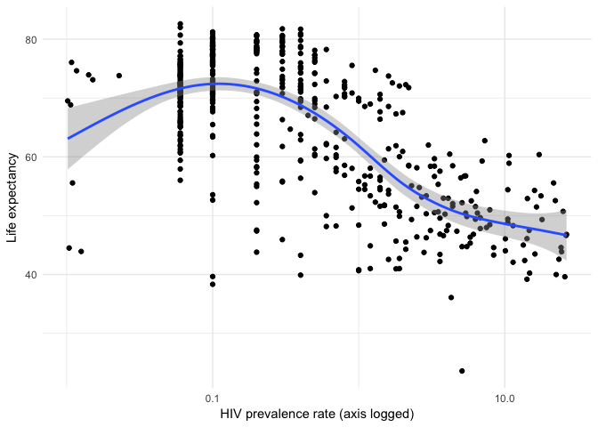
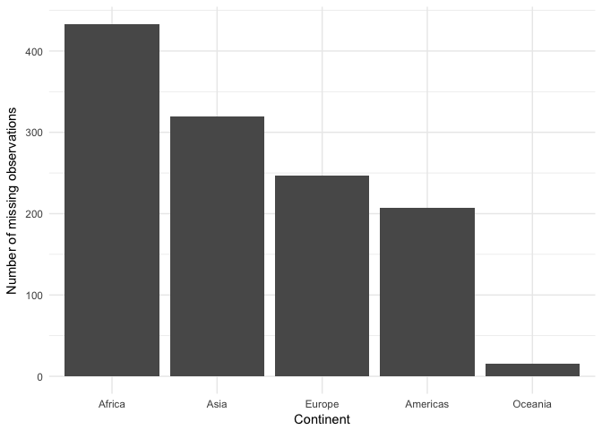

Joining Gapminder Data
================
Benjamin Soltoff
October 10, 2017

Get the original data
=====================

``` r
library(tidyverse)
library(gapminder)

theme_set(theme_minimal())
gapminder
```

    ## # A tibble: 1,704 x 6
    ##        country continent  year lifeExp      pop gdpPercap
    ##         <fctr>    <fctr> <int>   <dbl>    <int>     <dbl>
    ##  1 Afghanistan      Asia  1952  28.801  8425333  779.4453
    ##  2 Afghanistan      Asia  1957  30.332  9240934  820.8530
    ##  3 Afghanistan      Asia  1962  31.997 10267083  853.1007
    ##  4 Afghanistan      Asia  1967  34.020 11537966  836.1971
    ##  5 Afghanistan      Asia  1972  36.088 13079460  739.9811
    ##  6 Afghanistan      Asia  1977  38.438 14880372  786.1134
    ##  7 Afghanistan      Asia  1982  39.854 12881816  978.0114
    ##  8 Afghanistan      Asia  1987  40.822 13867957  852.3959
    ##  9 Afghanistan      Asia  1992  41.674 16317921  649.3414
    ## 10 Afghanistan      Asia  1997  41.763 22227415  635.3414
    ## # ... with 1,694 more rows

Import the HIV data
===================

    ## # A tibble: 3,301 x 3
    ##                     country  year    hivRate
    ##                       <chr> <int>      <dbl>
    ##  1                   Angola  1979 0.02652787
    ##  2                Argentina  1979 0.02050798
    ##  3                  Bahamas  1979 0.01000000
    ##  4                 Barbados  1979 0.02767648
    ##  5                 Botswana  1979 0.10597605
    ##  6                   Brazil  1979 0.09447913
    ##  7             Burkina Faso  1979 0.01000000
    ##  8                  Burundi  1979 0.01591388
    ##  9                   Canada  1979 0.01299849
    ## 10 Central African Republic  1979 0.11303478
    ## # ... with 3,291 more rows

What is the relationship between HIV prevalence and life expectancy?
====================================================================



Which continents have the most observations with missing HIV data?
==================================================================



Session info
------------

``` r
devtools::session_info()
```

    ##  setting  value                       
    ##  version  R version 3.4.1 (2017-06-30)
    ##  system   x86_64, darwin15.6.0        
    ##  ui       X11                         
    ##  language (EN)                        
    ##  collate  en_US.UTF-8                 
    ##  tz       America/Chicago             
    ##  date     2017-10-10                  
    ## 
    ##  package    * version    date       source                              
    ##  assertthat   0.2.0      2017-04-11 CRAN (R 3.4.0)                      
    ##  backports    1.1.0      2017-05-22 CRAN (R 3.4.0)                      
    ##  base       * 3.4.1      2017-07-07 local                               
    ##  bindr        0.1        2016-11-13 CRAN (R 3.4.0)                      
    ##  bindrcpp     0.2        2017-06-17 CRAN (R 3.4.0)                      
    ##  boxes        0.0.0.9000 2017-07-19 Github (r-pkgs/boxes@03098dc)       
    ##  broom        0.4.2      2017-08-09 local                               
    ##  cellranger   1.1.0      2016-07-27 CRAN (R 3.4.0)                      
    ##  clisymbols   1.2.0      2017-05-21 cran (@1.2.0)                       
    ##  codetools    0.2-15     2016-10-05 CRAN (R 3.4.1)                      
    ##  colorspace   1.3-2      2016-12-14 CRAN (R 3.4.0)                      
    ##  compiler     3.4.1      2017-07-07 local                               
    ##  crayon       1.3.4      2017-10-03 Github (gaborcsardi/crayon@b5221ab) 
    ##  datasets   * 3.4.1      2017-07-07 local                               
    ##  devtools     1.13.3     2017-08-02 CRAN (R 3.4.1)                      
    ##  digest       0.6.12     2017-01-27 CRAN (R 3.4.0)                      
    ##  dplyr      * 0.7.4.9000 2017-10-03 Github (tidyverse/dplyr@1a0730a)    
    ##  evaluate     0.10.1     2017-06-24 CRAN (R 3.4.1)                      
    ##  forcats    * 0.2.0      2017-01-23 CRAN (R 3.4.0)                      
    ##  foreign      0.8-69     2017-06-22 CRAN (R 3.4.1)                      
    ##  gapminder  * 0.2.0      2015-12-31 CRAN (R 3.4.0)                      
    ##  ggplot2    * 2.2.1      2016-12-30 CRAN (R 3.4.0)                      
    ##  glue         1.1.1      2017-06-21 CRAN (R 3.4.1)                      
    ##  graphics   * 3.4.1      2017-07-07 local                               
    ##  grDevices  * 3.4.1      2017-07-07 local                               
    ##  grid         3.4.1      2017-07-07 local                               
    ##  gtable       0.2.0      2016-02-26 CRAN (R 3.4.0)                      
    ##  haven        1.1.0      2017-07-09 CRAN (R 3.4.1)                      
    ##  hms          0.3        2016-11-22 CRAN (R 3.4.0)                      
    ##  htmltools    0.3.6      2017-04-28 CRAN (R 3.4.0)                      
    ##  httr         1.3.1      2017-08-20 CRAN (R 3.4.1)                      
    ##  jsonlite     1.5        2017-06-01 CRAN (R 3.4.0)                      
    ##  knitr        1.17       2017-08-10 cran (@1.17)                        
    ##  labeling     0.3        2014-08-23 CRAN (R 3.4.0)                      
    ##  lattice      0.20-35    2017-03-25 CRAN (R 3.4.1)                      
    ##  lazyeval     0.2.0      2016-06-12 CRAN (R 3.4.0)                      
    ##  lubridate    1.6.0      2016-09-13 CRAN (R 3.4.0)                      
    ##  magrittr     1.5        2014-11-22 CRAN (R 3.4.0)                      
    ##  Matrix       1.2-11     2017-08-16 CRAN (R 3.4.1)                      
    ##  memoise      1.1.0      2017-04-21 CRAN (R 3.4.0)                      
    ##  methods    * 3.4.1      2017-07-07 local                               
    ##  mgcv         1.8-18     2017-07-28 CRAN (R 3.4.1)                      
    ##  mnormt       1.5-5      2016-10-15 CRAN (R 3.4.0)                      
    ##  modelr       0.1.1      2017-08-10 local                               
    ##  munsell      0.4.3      2016-02-13 CRAN (R 3.4.0)                      
    ##  nlme         3.1-131    2017-02-06 CRAN (R 3.4.1)                      
    ##  parallel     3.4.1      2017-07-07 local                               
    ##  pkgconfig    2.0.1      2017-03-21 CRAN (R 3.4.0)                      
    ##  plyr         1.8.4      2016-06-08 CRAN (R 3.4.0)                      
    ##  psych        1.7.5      2017-05-03 CRAN (R 3.4.1)                      
    ##  purrr      * 0.2.3      2017-08-02 CRAN (R 3.4.1)                      
    ##  R6           2.2.2      2017-06-17 CRAN (R 3.4.0)                      
    ##  Rcpp         0.12.13    2017-09-28 cran (@0.12.13)                     
    ##  readr      * 1.1.1      2017-05-16 CRAN (R 3.4.0)                      
    ##  readxl       1.0.0      2017-04-18 CRAN (R 3.4.0)                      
    ##  reshape2     1.4.2      2016-10-22 CRAN (R 3.4.0)                      
    ##  rlang        0.1.2      2017-08-09 CRAN (R 3.4.1)                      
    ##  rmarkdown    1.6        2017-06-15 CRAN (R 3.4.0)                      
    ##  rprojroot    1.2        2017-01-16 CRAN (R 3.4.0)                      
    ##  rstudioapi   0.6        2016-06-27 CRAN (R 3.4.0)                      
    ##  rvest        0.3.2      2016-06-17 CRAN (R 3.4.0)                      
    ##  scales       0.4.1      2016-11-09 CRAN (R 3.4.0)                      
    ##  stats      * 3.4.1      2017-07-07 local                               
    ##  stringi      1.1.5      2017-04-07 CRAN (R 3.4.0)                      
    ##  stringr    * 1.2.0      2017-02-18 CRAN (R 3.4.0)                      
    ##  tibble     * 1.3.4      2017-08-22 CRAN (R 3.4.1)                      
    ##  tidyr      * 0.7.0      2017-08-16 CRAN (R 3.4.1)                      
    ##  tidyverse  * 1.1.1.9000 2017-07-19 Github (tidyverse/tidyverse@a028619)
    ##  tools        3.4.1      2017-07-07 local                               
    ##  utils      * 3.4.1      2017-07-07 local                               
    ##  withr        2.0.0      2017-07-28 CRAN (R 3.4.1)                      
    ##  xml2         1.1.1      2017-01-24 CRAN (R 3.4.0)                      
    ##  yaml         2.1.14     2016-11-12 CRAN (R 3.4.0)
