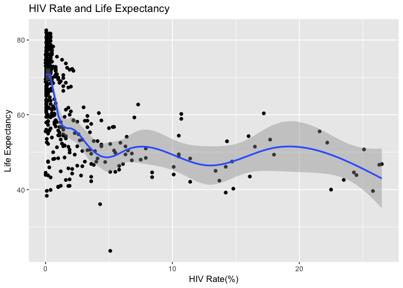
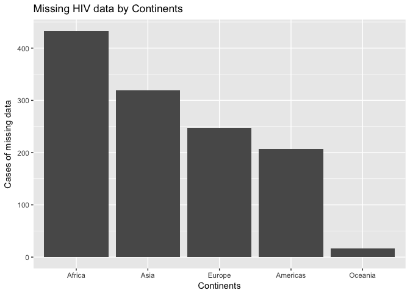

Joining Gapminder Data
================
Hoi-Ying Mak

Get the original data
=====================

``` r
library(tidyverse)
```

    ## ── Attaching packages ───────────────────────── tidyverse 1.2.1 ──

    ## ✔ ggplot2 2.2.1     ✔ purrr   0.2.4
    ## ✔ tibble  1.4.2     ✔ dplyr   0.7.4
    ## ✔ tidyr   0.8.0     ✔ stringr 1.3.0
    ## ✔ readr   1.1.1     ✔ forcats 0.3.0

    ## ── Conflicts ──────────────────────────── tidyverse_conflicts() ──
    ## ✖ dplyr::filter() masks stats::filter()
    ## ✖ dplyr::lag()    masks stats::lag()

``` r
library(gapminder)

gapminder
```

    ## # A tibble: 1,704 x 6
    ##    country     continent  year lifeExp      pop gdpPercap
    ##    <fct>       <fct>     <int>   <dbl>    <int>     <dbl>
    ##  1 Afghanistan Asia       1952    28.8  8425333      779.
    ##  2 Afghanistan Asia       1957    30.3  9240934      821.
    ##  3 Afghanistan Asia       1962    32.0 10267083      853.
    ##  4 Afghanistan Asia       1967    34.0 11537966      836.
    ##  5 Afghanistan Asia       1972    36.1 13079460      740.
    ##  6 Afghanistan Asia       1977    38.4 14880372      786.
    ##  7 Afghanistan Asia       1982    39.9 12881816      978.
    ##  8 Afghanistan Asia       1987    40.8 13867957      852.
    ##  9 Afghanistan Asia       1992    41.7 16317921      649.
    ## 10 Afghanistan Asia       1997    41.8 22227415      635.
    ## # ... with 1,694 more rows

Import the HIV data
===================

``` r
#Import and print the HIV data using read_csv
(hiv <- read_csv("data/gapminder_hiv.csv"))
```

    ## Parsed with column specification:
    ## cols(
    ##   country = col_character(),
    ##   year = col_integer(),
    ##   hivRate = col_double()
    ## )

    ## # A tibble: 3,301 x 3
    ##    country                   year hivRate
    ##    <chr>                    <int>   <dbl>
    ##  1 Angola                    1979  0.0265
    ##  2 Argentina                 1979  0.0205
    ##  3 Bahamas                   1979  0.0100
    ##  4 Barbados                  1979  0.0277
    ##  5 Botswana                  1979  0.106 
    ##  6 Brazil                    1979  0.0945
    ##  7 Burkina Faso              1979  0.0100
    ##  8 Burundi                   1979  0.0159
    ##  9 Canada                    1979  0.0130
    ## 10 Central African Republic  1979  0.113 
    ## # ... with 3,291 more rows

What is the relationship between HIV prevalence and life expectancy?
====================================================================

``` r
#Use left join instead of inner join because requiring HIV rate data to have match for all variables in gapminder will result in a loss of valable observations. Use geom_point and geom_smooth to show the cases and trend simultaneously. 
(hiv_life <- left_join(gapminder, hiv)) %>%
  ggplot(aes(hivRate, lifeExp)) +
  geom_point() +
  geom_smooth() +
  labs(title = "HIV Rate and Life Expectancy",
       x = "HIV Rate(%)",
       y = "Life Expectancy")
```

    ## Joining, by = c("country", "year")

    ## Warning: Column `country` joining factor and character vector, coercing
    ## into character vector

    ## `geom_smooth()` using method = 'gam'

    ## Warning: Removed 1222 rows containing non-finite values (stat_smooth).

    ## Warning: Removed 1222 rows containing missing values (geom_point).



``` r
#The graph shows that countries have lower (<2.5%) HIV rate generally have higher life expectancy. However, the point graph shows there are a few outliners that have medium HIV rate(~5%) but extremely low life expentancy (below 40). 
```

Which continents have the most countries with missing HIV data?
===============================================================

``` r
#Use full join so that the cells with HIV data are preserved after the merge of data frames. Then, filter these missing HIV data. Then, use fct_infreq to reorder continents by number of cases missing data. 
(hiv_life_2 <- full_join(gapminder, hiv)) %>%
  filter(is.na(hiv_life_2$hivRate)) %>%
  ggplot(aes(fct_infreq(continent))) +
  geom_bar() +
  labs(title = "Missing HIV data by Continents",
       x = "Continents",
       y = "Cases of missing data")
```

    ## Joining, by = c("country", "year")

    ## Warning: Column `country` joining factor and character vector, coercing
    ## into character vector



``` r
#Africa has the highest number of missing HIV data (>400 cases). Oceania, the least populated among all continents, has the lowest cases of missing HIV data (<50 cases).
```

Session info
------------

``` r
devtools::session_info()
```

    ## Session info -------------------------------------------------------------

    ##  setting  value                       
    ##  version  R version 3.4.4 (2018-03-15)
    ##  system   x86_64, darwin15.6.0        
    ##  ui       X11                         
    ##  language (EN)                        
    ##  collate  en_US.UTF-8                 
    ##  tz       America/Chicago             
    ##  date     2018-04-15

    ## Packages -----------------------------------------------------------------

    ##  package    * version   date       source                           
    ##  assertthat   0.2.0     2017-04-11 CRAN (R 3.4.0)                   
    ##  backports    1.1.2     2017-12-13 cran (@1.1.2)                    
    ##  base       * 3.4.4     2018-03-15 local                            
    ##  bindr        0.1.1     2018-03-13 CRAN (R 3.4.4)                   
    ##  bindrcpp   * 0.2       2017-06-17 CRAN (R 3.4.0)                   
    ##  broom        0.4.3     2017-11-20 CRAN (R 3.4.3)                   
    ##  cellranger   1.1.0     2016-07-27 cran (@1.1.0)                    
    ##  cli          1.0.0     2017-11-05 CRAN (R 3.4.2)                   
    ##  colorspace   1.3-2     2016-12-14 cran (@1.3-2)                    
    ##  compiler     3.4.4     2018-03-15 local                            
    ##  crayon       1.3.4     2017-09-16 CRAN (R 3.4.1)                   
    ##  datasets   * 3.4.4     2018-03-15 local                            
    ##  devtools     1.13.5    2018-02-18 CRAN (R 3.4.3)                   
    ##  digest       0.6.15    2018-01-28 CRAN (R 3.4.3)                   
    ##  dplyr      * 0.7.4     2017-09-28 CRAN (R 3.4.2)                   
    ##  evaluate     0.10.1    2017-06-24 cran (@0.10.1)                   
    ##  forcats    * 0.3.0     2018-02-19 cran (@0.3.0)                    
    ##  foreign      0.8-69    2017-06-22 CRAN (R 3.4.4)                   
    ##  gapminder  * 0.3.0     2017-10-31 CRAN (R 3.4.2)                   
    ##  ggplot2    * 2.2.1     2016-12-30 cran (@2.2.1)                    
    ##  glue         1.2.0     2017-10-29 CRAN (R 3.4.2)                   
    ##  graphics   * 3.4.4     2018-03-15 local                            
    ##  grDevices  * 3.4.4     2018-03-15 local                            
    ##  grid         3.4.4     2018-03-15 local                            
    ##  gtable       0.2.0     2016-02-26 cran (@0.2.0)                    
    ##  haven        1.1.1     2018-01-18 cran (@1.1.1)                    
    ##  hms          0.4.2     2018-03-10 cran (@0.4.2)                    
    ##  htmltools    0.3.6     2017-04-28 cran (@0.3.6)                    
    ##  httr         1.3.1     2017-08-20 CRAN (R 3.4.1)                   
    ##  jsonlite     1.5       2017-06-01 CRAN (R 3.4.0)                   
    ##  knitr        1.20      2018-02-20 CRAN (R 3.4.3)                   
    ##  labeling     0.3       2014-08-23 cran (@0.3)                      
    ##  lattice      0.20-35   2017-03-25 CRAN (R 3.4.4)                   
    ##  lazyeval     0.2.1     2017-10-29 cran (@0.2.1)                    
    ##  lubridate    1.7.3     2018-02-27 cran (@1.7.3)                    
    ##  magrittr     1.5       2014-11-22 CRAN (R 3.4.0)                   
    ##  Matrix       1.2-12    2017-11-30 CRAN (R 3.4.4)                   
    ##  memoise      1.1.0     2017-04-21 CRAN (R 3.4.0)                   
    ##  methods    * 3.4.4     2018-03-15 local                            
    ##  mgcv         1.8-23    2018-01-21 CRAN (R 3.4.4)                   
    ##  mnormt       1.5-5     2016-10-15 CRAN (R 3.4.0)                   
    ##  modelr       0.1.1     2017-07-24 cran (@0.1.1)                    
    ##  munsell      0.4.3     2016-02-13 cran (@0.4.3)                    
    ##  nlme         3.1-131.1 2018-02-16 CRAN (R 3.4.4)                   
    ##  parallel     3.4.4     2018-03-15 local                            
    ##  pillar       1.2.1     2018-02-27 CRAN (R 3.4.3)                   
    ##  pkgconfig    2.0.1     2017-03-21 CRAN (R 3.4.0)                   
    ##  plyr         1.8.4     2016-06-08 CRAN (R 3.4.0)                   
    ##  psych        1.7.8     2017-09-09 CRAN (R 3.4.4)                   
    ##  purrr      * 0.2.4     2017-10-18 CRAN (R 3.4.2)                   
    ##  R6           2.2.2     2017-06-17 CRAN (R 3.4.0)                   
    ##  Rcpp         0.12.16   2018-03-13 CRAN (R 3.4.4)                   
    ##  readr      * 1.1.1     2017-05-16 cran (@1.1.1)                    
    ##  readxl       1.0.0     2017-04-18 cran (@1.0.0)                    
    ##  reshape2     1.4.3     2017-12-11 CRAN (R 3.4.3)                   
    ##  rlang        0.2.0     2018-02-20 CRAN (R 3.4.3)                   
    ##  rmarkdown    1.9       2018-03-01 CRAN (R 3.4.3)                   
    ##  rprojroot    1.3-2     2018-01-03 cran (@1.3-2)                    
    ##  rstudioapi   0.7       2017-09-07 CRAN (R 3.4.1)                   
    ##  rvest        0.3.2     2016-06-17 cran (@0.3.2)                    
    ##  scales       0.5.0     2017-08-24 cran (@0.5.0)                    
    ##  stats      * 3.4.4     2018-03-15 local                            
    ##  stringi      1.1.7     2018-03-12 CRAN (R 3.4.4)                   
    ##  stringr    * 1.3.0     2018-02-19 CRAN (R 3.4.3)                   
    ##  tibble     * 1.4.2     2018-01-22 CRAN (R 3.4.3)                   
    ##  tidyr      * 0.8.0     2018-01-29 CRAN (R 3.4.3)                   
    ##  tidyverse  * 1.2.1     2018-03-30 Github (hadley/tidyverse@03ccf9c)
    ##  tools        3.4.4     2018-03-15 local                            
    ##  utf8         1.1.3     2018-01-03 CRAN (R 3.4.3)                   
    ##  utils      * 3.4.4     2018-03-15 local                            
    ##  withr        2.1.2     2018-03-15 CRAN (R 3.4.4)                   
    ##  xml2         1.2.0     2018-01-24 cran (@1.2.0)                    
    ##  yaml         2.1.18    2018-03-08 cran (@2.1.18)
