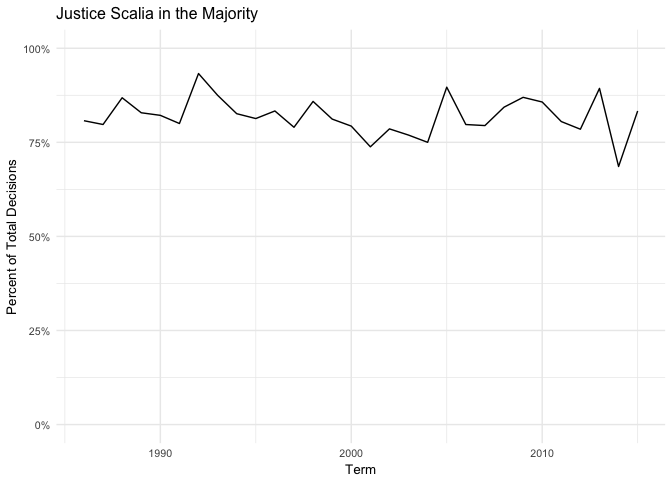
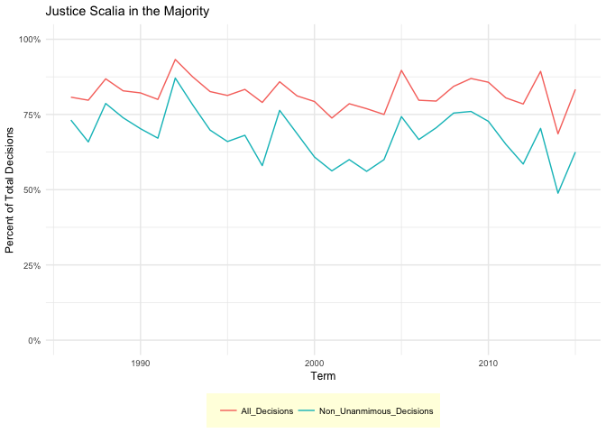

Exploring U.S. Supreme Court Decisions
================
Hoi-Ying Mak

Get the data
------------

``` r
# load useful packages
library(tidyverse)
```

    ## ── Attaching packages ─── tidyverse 1.2.1 ──

    ## ✔ ggplot2 2.2.1     ✔ purrr   0.2.4
    ## ✔ tibble  1.4.2     ✔ dplyr   0.7.4
    ## ✔ tidyr   0.8.0     ✔ stringr 1.3.0
    ## ✔ readr   1.1.1     ✔ forcats 0.3.0

    ## ── Conflicts ────── tidyverse_conflicts() ──
    ## ✖ dplyr::filter() masks stats::filter()
    ## ✖ dplyr::lag()    masks stats::lag()

``` r
# load data
scdbv_mod <- read_csv("data/SCDB_2017_01_justiceCentered_Citation.csv")
```

    ## Parsed with column specification:
    ## cols(
    ##   .default = col_integer(),
    ##   caseId = col_character(),
    ##   docketId = col_character(),
    ##   caseIssuesId = col_character(),
    ##   voteId = col_character(),
    ##   dateDecision = col_character(),
    ##   usCite = col_character(),
    ##   sctCite = col_character(),
    ##   ledCite = col_character(),
    ##   lexisCite = col_character(),
    ##   chief = col_character(),
    ##   caseName = col_character(),
    ##   dateArgument = col_character(),
    ##   dateRearg = col_character(),
    ##   lawMinor = col_character(),
    ##   justiceName = col_character()
    ## )

    ## See spec(...) for full column specifications.

    ## Warning in rbind(names(probs), probs_f): number of columns of result is not
    ## a multiple of vector length (arg 1)

    ## Warning: 50789 parsing failures.
    ## row # A tibble: 5 x 5 col     row col    expected               actual file                          expected   <int> <chr>  <chr>                  <chr>  <chr>                         actual 1  1225 docket no trailing characters M      'data/SCDB_2017_01_justiceCe… file 2  1226 docket no trailing characters M      'data/SCDB_2017_01_justiceCe… row 3  1227 docket no trailing characters M      'data/SCDB_2017_01_justiceCe… col 4  1228 docket no trailing characters M      'data/SCDB_2017_01_justiceCe… expected 5  1229 docket no trailing characters M      'data/SCDB_2017_01_justiceCe…
    ## ... ................. ... .......................................................................... ........ .......................................................................... ...... .......................................................................... .... .......................................................................... ... .......................................................................... ... .......................................................................... ........ ..........................................................................
    ## See problems(...) for more details.

``` r
scdbv_leg <- read_csv("data/SCDB_Legacy_03_justiceCentered_Citation.csv")
```

    ## Parsed with column specification:
    ## cols(
    ##   .default = col_integer(),
    ##   caseId = col_character(),
    ##   docketId = col_character(),
    ##   caseIssuesId = col_character(),
    ##   voteId = col_character(),
    ##   dateDecision = col_character(),
    ##   usCite = col_character(),
    ##   sctCite = col_character(),
    ##   ledCite = col_character(),
    ##   lexisCite = col_character(),
    ##   chief = col_character(),
    ##   docket = col_character(),
    ##   caseName = col_character(),
    ##   dateArgument = col_character(),
    ##   dateRearg = col_character(),
    ##   adminAction = col_character(),
    ##   adminActionState = col_character(),
    ##   lawMinor = col_character(),
    ##   justiceName = col_character()
    ## )
    ## See spec(...) for full column specifications.

``` r
scdbv_mod
```

    ## # A tibble: 78,857 x 61
    ##    caseId  docketId  caseIssuesId voteId  dateDecision decisionType usCite
    ##    <chr>   <chr>     <chr>        <chr>   <chr>               <int> <chr> 
    ##  1 1946-0… 1946-001… 1946-001-01… 1946-0… 11/18/1946              1 329 U…
    ##  2 1946-0… 1946-001… 1946-001-01… 1946-0… 11/18/1946              1 329 U…
    ##  3 1946-0… 1946-001… 1946-001-01… 1946-0… 11/18/1946              1 329 U…
    ##  4 1946-0… 1946-001… 1946-001-01… 1946-0… 11/18/1946              1 329 U…
    ##  5 1946-0… 1946-001… 1946-001-01… 1946-0… 11/18/1946              1 329 U…
    ##  6 1946-0… 1946-001… 1946-001-01… 1946-0… 11/18/1946              1 329 U…
    ##  7 1946-0… 1946-001… 1946-001-01… 1946-0… 11/18/1946              1 329 U…
    ##  8 1946-0… 1946-001… 1946-001-01… 1946-0… 11/18/1946              1 329 U…
    ##  9 1946-0… 1946-001… 1946-001-01… 1946-0… 11/18/1946              1 329 U…
    ## 10 1946-0… 1946-002… 1946-002-01… 1946-0… 11/18/1946              1 329 U…
    ## # ... with 78,847 more rows, and 54 more variables: sctCite <chr>,
    ## #   ledCite <chr>, lexisCite <chr>, term <int>, naturalCourt <int>,
    ## #   chief <chr>, docket <int>, caseName <chr>, dateArgument <chr>,
    ## #   dateRearg <chr>, petitioner <int>, petitionerState <int>,
    ## #   respondent <int>, respondentState <int>, jurisdiction <int>,
    ## #   adminAction <int>, adminActionState <int>, threeJudgeFdc <int>,
    ## #   caseOrigin <int>, caseOriginState <int>, caseSource <int>,
    ## #   caseSourceState <int>, lcDisagreement <int>, certReason <int>,
    ## #   lcDisposition <int>, lcDispositionDirection <int>,
    ## #   declarationUncon <int>, caseDisposition <int>,
    ## #   caseDispositionUnusual <int>, partyWinning <int>,
    ## #   precedentAlteration <int>, voteUnclear <int>, issue <int>,
    ## #   issueArea <int>, decisionDirection <int>,
    ## #   decisionDirectionDissent <int>, authorityDecision1 <int>,
    ## #   authorityDecision2 <int>, lawType <int>, lawSupp <int>,
    ## #   lawMinor <chr>, majOpinWriter <int>, majOpinAssigner <int>,
    ## #   splitVote <int>, majVotes <int>, minVotes <int>, justice <int>,
    ## #   justiceName <chr>, vote <int>, opinion <int>, direction <int>,
    ## #   majority <int>, firstAgreement <int>, secondAgreement <int>

``` r
scdbv_leg
```

    ## # A tibble: 172,215 x 61
    ##    caseId  docketId  caseIssuesId voteId  dateDecision decisionType usCite
    ##    <chr>   <chr>     <chr>        <chr>   <chr>               <int> <chr> 
    ##  1 1791-0… 1791-001… 1791-001-01… 1791-0… 8/3/1791                6 2 U.S…
    ##  2 1791-0… 1791-001… 1791-001-01… 1791-0… 8/3/1791                6 2 U.S…
    ##  3 1791-0… 1791-001… 1791-001-01… 1791-0… 8/3/1791                6 2 U.S…
    ##  4 1791-0… 1791-001… 1791-001-01… 1791-0… 8/3/1791                6 2 U.S…
    ##  5 1791-0… 1791-001… 1791-001-01… 1791-0… 8/3/1791                6 2 U.S…
    ##  6 1791-0… 1791-002… 1791-002-01… 1791-0… 8/3/1791                2 2 U.S…
    ##  7 1791-0… 1791-002… 1791-002-01… 1791-0… 8/3/1791                2 2 U.S…
    ##  8 1791-0… 1791-002… 1791-002-01… 1791-0… 8/3/1791                2 2 U.S…
    ##  9 1791-0… 1791-002… 1791-002-01… 1791-0… 8/3/1791                2 2 U.S…
    ## 10 1791-0… 1791-002… 1791-002-01… 1791-0… 8/3/1791                2 2 U.S…
    ## # ... with 172,205 more rows, and 54 more variables: sctCite <chr>,
    ## #   ledCite <chr>, lexisCite <chr>, term <int>, naturalCourt <int>,
    ## #   chief <chr>, docket <chr>, caseName <chr>, dateArgument <chr>,
    ## #   dateRearg <chr>, petitioner <int>, petitionerState <int>,
    ## #   respondent <int>, respondentState <int>, jurisdiction <int>,
    ## #   adminAction <chr>, adminActionState <chr>, threeJudgeFdc <int>,
    ## #   caseOrigin <int>, caseOriginState <int>, caseSource <int>,
    ## #   caseSourceState <int>, lcDisagreement <int>, certReason <int>,
    ## #   lcDisposition <int>, lcDispositionDirection <int>,
    ## #   declarationUncon <int>, caseDisposition <int>,
    ## #   caseDispositionUnusual <int>, partyWinning <int>,
    ## #   precedentAlteration <int>, voteUnclear <int>, issue <int>,
    ## #   issueArea <int>, decisionDirection <int>,
    ## #   decisionDirectionDissent <int>, authorityDecision1 <int>,
    ## #   authorityDecision2 <int>, lawType <int>, lawSupp <int>,
    ## #   lawMinor <chr>, majOpinWriter <int>, majOpinAssigner <int>,
    ## #   splitVote <int>, majVotes <int>, minVotes <int>, justice <int>,
    ## #   justiceName <chr>, vote <int>, opinion <int>, direction <int>,
    ## #   majority <int>, firstAgreement <int>, secondAgreement <int>

Combine the datasets
--------------------

``` r
#To efficiently combine the character/numeric columns, I at first tried "mutate_all" to coerce all numeric variables into as.characters. But soon I realise it limits my ability to perform numeric calculations such as MajVotes - MinVotes in the subsequent question. After numerous trials and errors I found the most efficient method here http://stat545.com/block029_factors.html.
# scdbv <- # add your code here
scdbv_all <- rbind(scdbv_leg, scdbv_mod)
scdbv_all
```

    ## # A tibble: 251,072 x 61
    ##    caseId  docketId  caseIssuesId voteId  dateDecision decisionType usCite
    ##    <chr>   <chr>     <chr>        <chr>   <chr>               <int> <chr> 
    ##  1 1791-0… 1791-001… 1791-001-01… 1791-0… 8/3/1791                6 2 U.S…
    ##  2 1791-0… 1791-001… 1791-001-01… 1791-0… 8/3/1791                6 2 U.S…
    ##  3 1791-0… 1791-001… 1791-001-01… 1791-0… 8/3/1791                6 2 U.S…
    ##  4 1791-0… 1791-001… 1791-001-01… 1791-0… 8/3/1791                6 2 U.S…
    ##  5 1791-0… 1791-001… 1791-001-01… 1791-0… 8/3/1791                6 2 U.S…
    ##  6 1791-0… 1791-002… 1791-002-01… 1791-0… 8/3/1791                2 2 U.S…
    ##  7 1791-0… 1791-002… 1791-002-01… 1791-0… 8/3/1791                2 2 U.S…
    ##  8 1791-0… 1791-002… 1791-002-01… 1791-0… 8/3/1791                2 2 U.S…
    ##  9 1791-0… 1791-002… 1791-002-01… 1791-0… 8/3/1791                2 2 U.S…
    ## 10 1791-0… 1791-002… 1791-002-01… 1791-0… 8/3/1791                2 2 U.S…
    ## # ... with 251,062 more rows, and 54 more variables: sctCite <chr>,
    ## #   ledCite <chr>, lexisCite <chr>, term <int>, naturalCourt <int>,
    ## #   chief <chr>, docket <chr>, caseName <chr>, dateArgument <chr>,
    ## #   dateRearg <chr>, petitioner <int>, petitionerState <int>,
    ## #   respondent <int>, respondentState <int>, jurisdiction <int>,
    ## #   adminAction <chr>, adminActionState <chr>, threeJudgeFdc <int>,
    ## #   caseOrigin <int>, caseOriginState <int>, caseSource <int>,
    ## #   caseSourceState <int>, lcDisagreement <int>, certReason <int>,
    ## #   lcDisposition <int>, lcDispositionDirection <int>,
    ## #   declarationUncon <int>, caseDisposition <int>,
    ## #   caseDispositionUnusual <int>, partyWinning <int>,
    ## #   precedentAlteration <int>, voteUnclear <int>, issue <int>,
    ## #   issueArea <int>, decisionDirection <int>,
    ## #   decisionDirectionDissent <int>, authorityDecision1 <int>,
    ## #   authorityDecision2 <int>, lawType <int>, lawSupp <int>,
    ## #   lawMinor <chr>, majOpinWriter <int>, majOpinAssigner <int>,
    ## #   splitVote <int>, majVotes <int>, minVotes <int>, justice <int>,
    ## #   justiceName <chr>, vote <int>, opinion <int>, direction <int>,
    ## #   majority <int>, firstAgreement <int>, secondAgreement <int>

Recode variables as you find necessary
--------------------------------------

``` r
#Create a new variable for margin votes. Then, select 10 variables I need for this assignment.
scdbv <- scdbv_all %>%
  mutate(margin = majVotes - minVotes) %>%
  select(caseIssuesId, term, justice, justiceName, decisionDirection, majVotes, minVotes, margin, majority, chief, vote)
scdbv
```

    ## # A tibble: 251,072 x 11
    ##    caseIssuesId    term justice justiceName decisionDirection majVotes
    ##    <chr>          <int>   <int> <chr>                   <int>    <int>
    ##  1 1791-001-01-01  1791       1 JJay                        1        5
    ##  2 1791-001-01-01  1791       3 WCushing                    1        5
    ##  3 1791-001-01-01  1791       4 JWilson                     1        5
    ##  4 1791-001-01-01  1791       5 JBlair                      1        5
    ##  5 1791-001-01-01  1791       6 JIredell                    1        5
    ##  6 1791-002-01-01  1791       1 JJay                        2        5
    ##  7 1791-002-01-01  1791       3 WCushing                    2        5
    ##  8 1791-002-01-01  1791       4 JWilson                     2        5
    ##  9 1791-002-01-01  1791       5 JBlair                      2        5
    ## 10 1791-002-01-01  1791       6 JIredell                    2        5
    ## # ... with 251,062 more rows, and 5 more variables: minVotes <int>,
    ## #   margin <int>, majority <int>, chief <chr>, vote <int>

What percentage of cases in each term are decided by a one-vote margin (i.e. 5-4, 4-3, etc.)
--------------------------------------------------------------------------------------------

``` r
#Identify the total number of cases by term. Use mutate to create a new variable for the percent of one vote margin decisions.
scdbv %>%
  group_by(term) %>%
  summarize(cases = n(), onevote = sum((margin == 1), na.rm = TRUE)) %>%
  mutate(percentone = (onevote/cases)) %>%
  ggplot(aes(term, percentone)) +
  geom_line() +
  scale_y_continuous(labels=scales::percent) +
  theme_gray(base_size = 10) +
  labs(title = "One Vote Margin Decisions",
       subtitle = "Proportion in U.S. Supreme Court History",
       x = "Term",
       y = "Percent in Total Decisions")
```


In each term he served on the Court, in what percentage of cases was Justice Antonin Scalia in the majority?
------------------------------------------------------------------------------------------------------------

``` r
# Find the ID for Justice Scalia on the directory http://scdb.wustl.edu/documentation.php?var=justice. Then, create a new variable for the percent of Justice Scalia voting in the majority (vote ==1).
scdbv %>%
  filter(justice == "105") %>%
  group_by(term) %>%
  summarize(scalia_all = n(), majority = sum((vote == 1 & 3 & 5), na.rm = TRUE)) %>%
  mutate(scalia_percent = (majority/scalia_all)) %>%
  
#Use the line graph to show the percentage of Justice Scalia's majority decisions throughout his term  
  ggplot(aes(term,scalia_percent)) +
  geom_line() +
  scale_y_continuous(labels=scales::percent, limits = c(0,1)) +
  theme_minimal(base_size = 10) +
  labs(title = "Justice Scalia in the Majority",
       x = "Term",
       y = "Percent of Total Decisions")
```



Create a graph similar to above that compares the percentage for all cases versus non-unanimous cases (i.e. there was at least one dissenting vote)
---------------------------------------------------------------------------------------------------------------------------------------------------

``` r
#Use mutate to create two variables: "All_Decisions" and "Non_Unanimous_Decisions", which reflect the percentage of all cases and non-unanimous cases respectively
scdbv %>%
  filter(justice == "105") %>%
  group_by(term) %>%
  summarize(scalia_all = n(), scalia_non = sum((minVotes!=0), na.rm = TRUE), majority = sum((vote == 1 & 3 & 5), na.rm = TRUE), majority_non = sum((vote == 1 & 3 & 5 & minVotes!=0), na.rm = TRUE)) %>%
  mutate(All_Decisions = (majority/scalia_all), Non_Unanmimous_Decisions = (majority_non/scalia_non)) %>%
  select(term, All_Decisions, Non_Unanmimous_Decisions) %>%
  gather(type, proportion, -term) %>%
  
#Plot the line graph, then refine the scale to percentage. Then, move the legend to the bottom and refine the text and color of it. http://www.sthda.com/english/wiki/ggplot2-legend-easy-steps-to-change-the-position-and-the-appearance-of-a-graph-legend-in-r-software
ggplot(aes(term, proportion, color = type)) +
  geom_line() +
  scale_y_continuous(labels=scales::percent, limits = c(0,1)) +
  theme_minimal(base_size = 9) +
  theme(legend.position = "bottom", legend.title = element_blank(), legend.background = element_rect(fill="lightyellow", linetype="blank")) +
  labs(title = "Justice Scalia in the Majority",
       x = "Term",
       y = "Percent of Total Decisions")
```



In each term, what percentage of cases were decided in the conservative direction?
----------------------------------------------------------------------------------

``` r
#Identify the total number of cases by year terms. Then, create a new variable for the percentage of conservative decisions (decisionDirection == 1). 
scdbv %>%
  group_by(term) %>%
  summarize(cases = n(), conservative = sum(decisionDirection == 1, na.rm = TRUE)) %>%
  mutate(percentcon = (conservative/cases)) %>%

#Plot a line graph showing the percentage of conservative decisions throughout the U.S. Supreme Court's History. Refine the scale of y-axis to 0.7 so that the nuanced ups and downs are better captured.
  ggplot(aes(term,percentcon)) +
  geom_line() +
  scale_y_continuous(labels=scales::percent, limits = c(0,0.7)) +
  theme_minimal(base_size = 10) +
  labs(title = "Conservative Decisions",
       subtitle = "Percentage in U.S. Supreme Court History",
       x = "Term",
       y = "Percent of Total Decisions")
```


The Chief Justice is frequently seen as capable of influencing the ideological direction of the Court. Create a graph similar to the one above that also incorporates information on who was the Chief Justice during the term.
-------------------------------------------------------------------------------------------------------------------------------------------------------------------------------------------------------------------------------

``` r
#Similar to Q4, but this time include the variable chief in group_by.
scdbv %>%
  group_by(term, chief) %>%
  summarize(cases = n(), conservative = sum(decisionDirection == 1, na.rm = TRUE)) %>%
  mutate(percentcon = (conservative/cases)) %>%
  select(term, chief, percentcon) %>%

#Plot the same line graph in Q4, with the clustering effect by Chief Justices' terms in color. Modify the size of the legend so that it can be properly shown. 
  ggplot(aes(term, percentcon)) +
  geom_line(aes(colour = factor(chief)))+
  scale_y_continuous(labels=scales::percent, limits = c(0,1)) +
  theme_minimal(base_size = 10) +
  theme(legend.key.size = unit(0.25, "cm"), legend.title = element_blank())+
  labs(title = "U.S. Supreme Court",
       subtitle = "Percent of Conservative Decisions in Chief Justices' Terms",
       x = "Term",
       y = "Percent of Total Decisions")
```


Session info
------------

``` r
devtools::session_info()
```

    ## Session info -------------------------------------------------------------

    ##  setting  value                       
    ##  version  R version 3.4.4 (2018-03-15)
    ##  system   x86_64, darwin15.6.0        
    ##  ui       X11                         
    ##  language (EN)                        
    ##  collate  en_US.UTF-8                 
    ##  tz       America/Chicago             
    ##  date     2018-04-14

    ## Packages -----------------------------------------------------------------

    ##  package    * version   date       source                           
    ##  assertthat   0.2.0     2017-04-11 CRAN (R 3.4.0)                   
    ##  backports    1.1.2     2017-12-13 cran (@1.1.2)                    
    ##  base       * 3.4.4     2018-03-15 local                            
    ##  bindr        0.1.1     2018-03-13 CRAN (R 3.4.4)                   
    ##  bindrcpp   * 0.2       2017-06-17 CRAN (R 3.4.0)                   
    ##  broom        0.4.3     2017-11-20 CRAN (R 3.4.3)                   
    ##  cellranger   1.1.0     2016-07-27 cran (@1.1.0)                    
    ##  cli          1.0.0     2017-11-05 CRAN (R 3.4.2)                   
    ##  colorspace   1.3-2     2016-12-14 cran (@1.3-2)                    
    ##  compiler     3.4.4     2018-03-15 local                            
    ##  crayon       1.3.4     2017-09-16 CRAN (R 3.4.1)                   
    ##  datasets   * 3.4.4     2018-03-15 local                            
    ##  devtools     1.13.5    2018-02-18 CRAN (R 3.4.3)                   
    ##  digest       0.6.15    2018-01-28 CRAN (R 3.4.3)                   
    ##  dplyr      * 0.7.4     2017-09-28 CRAN (R 3.4.2)                   
    ##  evaluate     0.10.1    2017-06-24 cran (@0.10.1)                   
    ##  forcats    * 0.3.0     2018-02-19 cran (@0.3.0)                    
    ##  foreign      0.8-69    2017-06-22 CRAN (R 3.4.4)                   
    ##  ggplot2    * 2.2.1     2016-12-30 cran (@2.2.1)                    
    ##  glue         1.2.0     2017-10-29 CRAN (R 3.4.2)                   
    ##  graphics   * 3.4.4     2018-03-15 local                            
    ##  grDevices  * 3.4.4     2018-03-15 local                            
    ##  grid         3.4.4     2018-03-15 local                            
    ##  gtable       0.2.0     2016-02-26 cran (@0.2.0)                    
    ##  haven        1.1.1     2018-01-18 cran (@1.1.1)                    
    ##  hms          0.4.2     2018-03-10 cran (@0.4.2)                    
    ##  htmltools    0.3.6     2017-04-28 cran (@0.3.6)                    
    ##  httr         1.3.1     2017-08-20 CRAN (R 3.4.1)                   
    ##  jsonlite     1.5       2017-06-01 CRAN (R 3.4.0)                   
    ##  knitr        1.20      2018-02-20 CRAN (R 3.4.3)                   
    ##  labeling     0.3       2014-08-23 cran (@0.3)                      
    ##  lattice      0.20-35   2017-03-25 CRAN (R 3.4.4)                   
    ##  lazyeval     0.2.1     2017-10-29 cran (@0.2.1)                    
    ##  lubridate    1.7.3     2018-02-27 cran (@1.7.3)                    
    ##  magrittr     1.5       2014-11-22 CRAN (R 3.4.0)                   
    ##  memoise      1.1.0     2017-04-21 CRAN (R 3.4.0)                   
    ##  methods    * 3.4.4     2018-03-15 local                            
    ##  mnormt       1.5-5     2016-10-15 CRAN (R 3.4.0)                   
    ##  modelr       0.1.1     2017-07-24 cran (@0.1.1)                    
    ##  munsell      0.4.3     2016-02-13 cran (@0.4.3)                    
    ##  nlme         3.1-131.1 2018-02-16 CRAN (R 3.4.4)                   
    ##  parallel     3.4.4     2018-03-15 local                            
    ##  pillar       1.2.1     2018-02-27 CRAN (R 3.4.3)                   
    ##  pkgconfig    2.0.1     2017-03-21 CRAN (R 3.4.0)                   
    ##  plyr         1.8.4     2016-06-08 CRAN (R 3.4.0)                   
    ##  psych        1.7.8     2017-09-09 CRAN (R 3.4.4)                   
    ##  purrr      * 0.2.4     2017-10-18 CRAN (R 3.4.2)                   
    ##  R6           2.2.2     2017-06-17 CRAN (R 3.4.0)                   
    ##  Rcpp         0.12.16   2018-03-13 CRAN (R 3.4.4)                   
    ##  readr      * 1.1.1     2017-05-16 cran (@1.1.1)                    
    ##  readxl       1.0.0     2017-04-18 cran (@1.0.0)                    
    ##  reshape2     1.4.3     2017-12-11 CRAN (R 3.4.3)                   
    ##  rlang        0.2.0     2018-02-20 CRAN (R 3.4.3)                   
    ##  rmarkdown    1.9       2018-03-01 CRAN (R 3.4.3)                   
    ##  rprojroot    1.3-2     2018-01-03 cran (@1.3-2)                    
    ##  rstudioapi   0.7       2017-09-07 CRAN (R 3.4.1)                   
    ##  rvest        0.3.2     2016-06-17 cran (@0.3.2)                    
    ##  scales       0.5.0     2017-08-24 cran (@0.5.0)                    
    ##  stats      * 3.4.4     2018-03-15 local                            
    ##  stringi      1.1.7     2018-03-12 CRAN (R 3.4.4)                   
    ##  stringr    * 1.3.0     2018-02-19 CRAN (R 3.4.3)                   
    ##  tibble     * 1.4.2     2018-01-22 CRAN (R 3.4.3)                   
    ##  tidyr      * 0.8.0     2018-01-29 CRAN (R 3.4.3)                   
    ##  tidyselect   0.2.4     2018-02-26 CRAN (R 3.4.3)                   
    ##  tidyverse  * 1.2.1     2018-03-30 Github (hadley/tidyverse@03ccf9c)
    ##  tools        3.4.4     2018-03-15 local                            
    ##  utf8         1.1.3     2018-01-03 CRAN (R 3.4.3)                   
    ##  utils      * 3.4.4     2018-03-15 local                            
    ##  withr        2.1.2     2018-03-15 CRAN (R 3.4.4)                   
    ##  xml2         1.2.0     2018-01-24 cran (@1.2.0)                    
    ##  yaml         2.1.18    2018-03-08 cran (@2.1.18)
